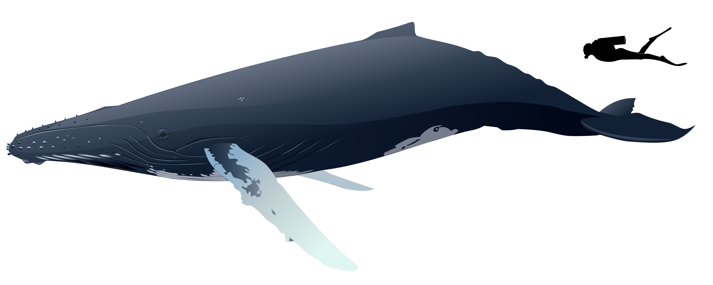
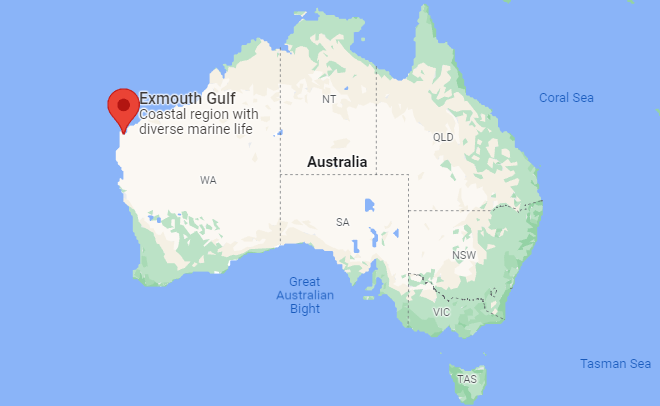

```{r setup, include=FALSE}
knitr::opts_chunk$set(echo = FALSE)
options(tinytex.verbose = TRUE)
```

```{r, echo = F, results = "hide", message = FALSE, warning = FALSE}
# aux functions
source("./../Paper/Auxilliary.R")

# packages
get.package(c("ggplot2", "patchwork"))
```

# Intro and Motivation

* The Western Australian whale population has increased substantially since the cessation of whaling (1979) and is estimated to comprise 20–30,000 whales, increasing 9–12.7% per year (Bejder et al., 2016)

* Whale-watching is a multi-billion-dollar industry that is growing around the world. Typically, tour operators use boats to transport tourists into coastal waters to see groups of whales, dolphins or porpoises

* Marine Biologists report accumulating evidence that boat-based whale-watching negatively affects whale's behavior

```{r, out.width = "85%", fig.align = "center", fig.cap = "Humpback Whale"}

```

# Experiment Location 

* The tests were performed between 21°45′–22°33′S and 114°08′–114°40′E, from August 1st to October 31st 2018

* The Gulf is an important resting ground for mother and calves, that rest and nurse for a few weeks before continuing their southern migration to their high latitude feeding grounds

```{r, out.width = "85%", fig.align = "center", fig.cap = "Experiment Location"}

```

# Experiment Description and Data Generation

* Vessel approaches consisted of a typical whale-watch approach; transiting past a logging mother-calf pair at 100 m distance at slow speed

* Vessel noise was played through a transducer that was suspended from the side of the vessel to 1.5 m below the surface to mimic typical depth of propellers/shaft/exhaust of whale-watching vessels.

* The vessel noise imitation was set to different levels: control (124 dB), low (148 dB), medium (160 dB) and high (172 dB)

```{r, out.width = "85%", fig.align = "center", fig.cap = "Experiment Design"}
knitr::include_graphics("exper.jpg")
```

# Data 

* The Data set contains 42 observations, for which there exist three entries per noise level. One before, one during and one after the whales were exposed to the synthetic vessel noises

* Three different measures were taken:
  - The respiration rate was calculated as the number of breaths per minute
  - The mean swim speed (m/s), calculated by dividing the distance traveled by the duration of a video recording
  - The proportion of time resting
  
# First Comparisons: Respiration Rate

```{r, out.width = "80%", fig.align = "center", fig.cap = "Respiration Rate"}
knitr::include_graphics("respatory.pdf")
```

# First Comparisons: Proportion of Time Resting

```{r, out.width = "80%", fig.align = "center", fig.cap = "Respiration Rate"}
knitr::include_graphics("resting.pdf")
```

# First Comparisons: Speed

```{r, out.width = "80%", fig.align = "center", fig.cap = "Speed"}
knitr::include_graphics("speed.pdf")
```

# Similar Paper: Amrein et al.

* They observed the frequency of signature whale moves in presence and absence of vessels:
  - Breach
  - Tail-Up Dive
  - Pectoral Fin Slap
  - Head Slap
  - Singing
  - Resting
* Between August and September 2019, they recorded 47 behavioral
  sessions
* These 47 samples consisted of 24 mother and calf pairs (51%), 11 competitive group sightings
(23%), seven lone whale sightings (15%), and five paired adult
sightings (11%).

# Experiment Location

* The study was conducted in the Las Perlas Archipelago (8.41°N,
79.02°W) in the Gulf of Panama, which lies about 60 km
southeast of Panama City

```{r, out.width = "85%", fig.align = "center", fig.cap = "Experiment Location"}
knitr::include_graphics("Loc_panama.PNG")
```
  
# Results

* Changes in whale behavior with increase in whale watching vessels in close proximity

```{r, out.width = "85%", fig.align = "center", fig.cap = "Results"}
knitr::include_graphics("boat_behaviour.PNG")
```
  

# Comparison of Statistical Methods 

* Sprogis et al.
  - Mixed effect models were constructed to investigate the effects of underwater vessel noise on mother-calf pairs
  - They examined:
    + within treatments to determine if there was an effect of treatment
    + among treatments to determine the severity of the treatment
  - A CEE (Controlled exposure experiment) was composed of three phases (before, during, after) on the same focal whale (i.e. repeated measures), thus to account for  any effect of individual, mother-calf identity was added as a random effect
 
 
* Amrein et al.
  - Used a Chi-squared goodness of fit test to measure the influence of boat density on whale behavior


